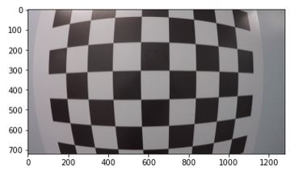
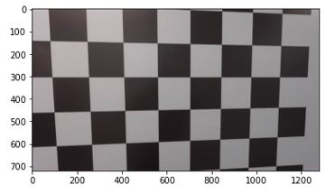

# Advanced Lane Detection

The aim of this project is detect road lanes, the road curvature and  center offset with Open CV,  to do this i used methods as camera calibration, perspective transform, color masks and Polynomial Fit.


The *Advanced Lane Finding* project is a step further from [Lane Lines Detection](https://github.com/Frenche5/Advanced-Lane-Line-Detection) 

In this project, we used a recording of a highway to detect lanes and identify the radius of the road and the deviation of the lane

We used to implemet this project the Open CV libraries in python. I used to do this jupiter notebook as editor and as a starting point I used the starter code by Udacity and can be found [here](https://github.com/udacity/CarND-Advanced-Lane-Lines).


## Camera Calibration

[Optic distortion](https://en.wikipedia.org/wiki/Distortion_(optics))In geometric optics, distortion is a deviation from rectilinear projection; a projection in which straight lines in a scene remain straight in an image. It is a form of optical aberration.

We use the images from the camera_cal folder obtained from the starting repository. Applying the "findchessboardcorners" function we can get the ends of the picture image, with this data we can later with the "undistort" function get a distortion-free image
```
def camera_calibration(nx=9,ny=6, dir="camera_cal/"):
    #3D points in real world space
    objpoints=[] 
    #2D points in image plane
    imgpoints=[] 
    
    objp = np.zeros((nx*ny,3), np.float32)
    objp[:,:2] = np.mgrid[0:nx,0:ny].T.reshape(-1,2)
  
    # List the calibration images
    os.listdir(dir)
    cal_list = os.listdir(dir)  
   
    
    for image_name in cal_list:
        import_from = dir + image_name
        img = cv2.imread(import_from)
        # Convert to grayscale
        gray = cv2.cvtColor(img, cv2.COLOR_BGR2GRAY)
        
        # Find the chessboard corners
        ret, corners = cv2.findChessboardCorners(gray, (nx, ny), None)
        
        # If found, append found corners
        if ret == True:
            imgpoints.append(corners)
            objpoints.append(objp)
    ret, mtx, dist, rvecs, tvecs = cv2.calibrateCamera(objpoints, imgpoints, gray.shape[::-1], None, None)
    return mtx, dist

```

All images in the "camera_cal" folder are used to obtain reliable and accurate distortion parameters, i designed a function to do this "camera_calibration"
This calibration is only executed the first cicle, and the rest of the execution uses the data obtained in this calibration. 
In this way i improved the efficiency of the program.
```
if  Count.f==0:
        #calibrate image
        mtx, dist=camera_calibration()
        cal_img= cv2.imread('camera_Cal/calibration3.jpg')
        M,M_I = corners_unwarp(cal_img, mtx, dist)
       
        Count.f=1
```
Finally i used Open CV “undistort” to correct each of the processed images



The result of the calibration can be easily seen, thus obtaining a more reliable starting point to identify the radio of the road lines correctly.


##  Perspective Transform, convert into top view

Tto calculate the curvature of the lines, the optimal shape and from a higher image, in this way the measurement will be much closer to reality.

To make this conversion wue use the pesrpective transform.


```
#Source points taken from images with straight lane lines, these are to become parallel after the warp transform
src = np.float32([
        (289, 659), # bottom left
        (574, 462), # top left
        (704, 462), # top right
        (1009, 659) # bottom right
        ])

# Destination points are to be parallel, taking into account the image size
dst = np.float32([
    [offset, img_size[1]],             # bottom-left corner
    [offset, 0],                       # top-left corner
    [img_size[0]-offset, 0],           # top-right corner
    [img_size[0]-offset, img_size[1]]  # bottom-right corner
])

```

OWe used OpenCV libraries to calculate the transformation matrix, obtained from an image and destination points. The unwarp_image function is created for this operation
```
def unwarp_image(img,M):
    img_size = (img.shape[1], img.shape[0])
    warped = cv2.warpPerspective(img, M, img_size, flags=cv2.INTER_LINEAR)
  
    return warped
```


##  Binary Threshold

In order to carry out the detection of the lines different changed techniques are used, to be able to take advantage of the best characteristics each one of them.
```
def threshold(img,s_thresh=(50 255), g_thresh=(150,255),h_thresh=(15,20)):
    global frame
    
    img = np.copy(img)
    gray = cv2.cvtColor(img, cv2.COLOR_BGR2GRAY)
    
    # Convert to HLS color space and separate the V channel
    hls = cv2.cvtColor(img, cv2.COLOR_RGB2HLS)
    h_channel = hls[:,:,0]
    s_channel = hls[:,:,2]
            
    # Threshold h channel   
    hbinary = np.zeros_like(h_channel)
    hbinary[( h_channel >= h_thresh[0]) & ( h_channel <= h_thresh[1])] = 1    
    
    # Threshold s channel
    sbinary = np.zeros_like(s_channel)
    sbinary[( s_channel >= s_thresh[0]) & ( s_channel <= s_thresh[1])] = 1
   

    # Threshol grayscale channel
    lgray = np.zeros_like(gray)
    lgray[( gray >= g_thresh[0]) & ( gray <= g_thresh[1])] = 1
    #eliminar
   
    # Stack each channel
    binary1 = lgray
    binary2 = cv2.bitwise_and(hbinary, sbinary)
    binary = cv2.bitwise_or(binary1, binary2)
    
    if((Count.i!=maxfail)or(Count.n!=0)):
        linesmask=cv2.bitwise_or( Right_line_param.poly_fitted,Left_line_param.poly_fitted)
        binary=cv2.bitwise_and(binary, linesmask)
    
```
the different channels of the image converted to hls mode are analyzed, and it is concluded that for the detection of yellow lines and the H channel between the values (15.20), for the white the H channel between the values (50 255), additionally a filter is made to the grayscale image to detect certain details, and finally a last mask of the polylines detected in the previous frame with an offset, in this way we avoid detections outside the region of interest dynamically


## Lane Line Detection 


To carry out the detection of lines we use the histogram of the image, detecting the most probable points from where the lines can be found at the base of the image.
From there with a system of windows and points, the lines are detected in the subsequent windows.
When the point system indicates that we have a poor detection quality, the histogram is performed again and the process begins.

```
    
 # Take a histogram of the bottom half of the image
    
    # HYPERPARAMETERS
    # Choose the number of sliding windows
    nwindows = 10
    # Set the width of the windows +/- margin
    margin = 100
    # Set minimum number of pixels found to recenter window
    minpix =80
   
    
    leftx_current=Right_line_param.recent_xfitted
    rightx_current=Left_line_param.recent_xfitted
    
    # Set the maximun of fails bin windows in frames
   
    window_height = np.int(binary_warped.shape[0]//nwindows)
    # Create an output image to draw on and visualize the result
    out_img = np.dstack((binary_warped, binary_warped, binary_warped))
    # Identify the x and y positions of all nonzero pixels in the image
    nonzero = binary_warped.nonzero()
    nonzeroy = np.array(nonzero[0])
    nonzerox = np.array(nonzero[1])
    
    if ((Count.i==maxfail)or(Count.n==maxfail)):
        
        histogram = np.sum(binary_warped[binary_warped.shape[0]//2:,:], axis=0)
        
        # Find the peak of the left and right halves of the histogram
        # These will be the starting point for the left and right lines
        midpoint = np.int(histogram.shape[0]//2)
        leftx_base = np.argmax(histogram[:midpoint])
        rightx_base = np.argmax(histogram[midpoint:]) + midpoint
        leftx_current = leftx_base
        rightx_current = rightx_base
        # Current positions to be updated later for each window in nwindows
        Count.i=0
        Count.n=0
        print("reset histrogram")
        
```


## Detection of Lane Lines Based  on a mean os previous cicles


To improve the stability of the system, an average of the points calculated with the last frames is made, in this way we minimize the possibility that bad instantaneous detections will unstable the system.
 ```
    #Calculate acumulative mean
   
    a=left_fitx
    b=lmean
    partial_lmean = [statistics.mean(k) for k in zip(a,b)]

    a=right_fitx
    b=rmean
    partial_rmean = [statistics.mean(k) for k in zip(a,b)]
         
    
    if Count.nmean==0:
        lmean=partial_lmean
        rmean=partial_rmean
        Count.nmean= n_itera
    else:            
        Count.nmean=Count.nmean-1
   # Recast the x and y points into usable format for cv2.fillPoly()

    pts_left = np.array([np.transpose(np.vstack([lmean, ploty]))])
    
    pts_right = np.array([np.flipud(np.transpose(np.vstack([rmean, ploty])))])
   

    pts = np.hstack((pts_left, pts_right))
 
    # Draw the lane onto the warped blank image
    cv2.fillPoly(color_warp, np.int_([pts]), (0,255,0))
    
    out_img=mix_images (color_warp, out_img, mix=0.8)
    
```


## Calculate Vehicle Position and Curve Radius

In order to calculate the real dimension of the measurements, a scale factor must be applied that equates the pixels to meters, in order to have the real values.
Then we use a mathematical expression that relates the plinomical equation of each line with the radius, and finally the mean of both lines is calculated, to obtain a single value

```
def measure_curvature(binary_warped, left_fitx, right_fitx, ploty):
    # Define conversions in x and y from pixels space to meters
    ym_per_pix = 30/720 # meters per pixel in y dimension
    xm_per_pix = 3.5/775 # meters per pixel in x dimension
    
    left_fit_cr = np.polyfit(ploty*ym_per_pix, left_fitx*xm_per_pix, 2)
    right_fit_cr = np.polyfit(ploty*ym_per_pix, right_fitx*xm_per_pix, 2)
    # Define y-value where we want radius of curvature
    # We'll choose the maximum y-value, corresponding to the bottom of the image
    y_eval = np.max(ploty)
    
    # Calculation of R_curve
    left_curverad = ((1 + (2*left_fit_cr[0]*y_eval*ym_per_pix + left_fit_cr[1])**2)**1.5) / np.absolute(2*left_fit_cr[0])
    right_curverad = ((1 + (2*right_fit_cr[0]*y_eval*ym_per_pix + right_fit_cr[1])**2)**1.5) / np.absolute(2*right_fit_cr[0])
    
    return left_curverad, right_curverad
```


To calculate the measurement of the lane offset, we take as a reference the center of the image, and the lower part of the calculated polynomials. As with the radius, we must also apply a scale factor that allows us to convert pixels into meters.
```
def measure_offset(binary_warped, left_fit, right_fit):
    # Define conversion in x from pixels space to meters
    xm_per_pix = 3.5/775 # meters per pixel (based on europe road with)
    # Choose the y value corresponding to the bottom of the image
    y_max = binary_warped.shape[0]
    # Calculate left and right line positions at the bottom of the image
    left_x_pos = left_fit[0]*y_max**2 + left_fit[1]*y_max + left_fit[2]
    right_x_pos = right_fit[0]*y_max**2 + right_fit[1]*y_max + right_fit[2] 
    # Calculate the x position of the center of the lane 
    center_lanes_x_pos = (left_x_pos + right_x_pos)//2
    # Calculate the deviation between the center of the lane and the center of the picture
    offset = ((binary_warped.shape[1]//2) - center_lanes_x_pos) * xm_per_pix 
    return offset
```


## Video Output

The result of the project video is: [project_out.mp4](project_out.mp4)

In the challenge video wue obtained good results but not pergfect:[challenge_out.mp4](chalenge_out.mp4)
